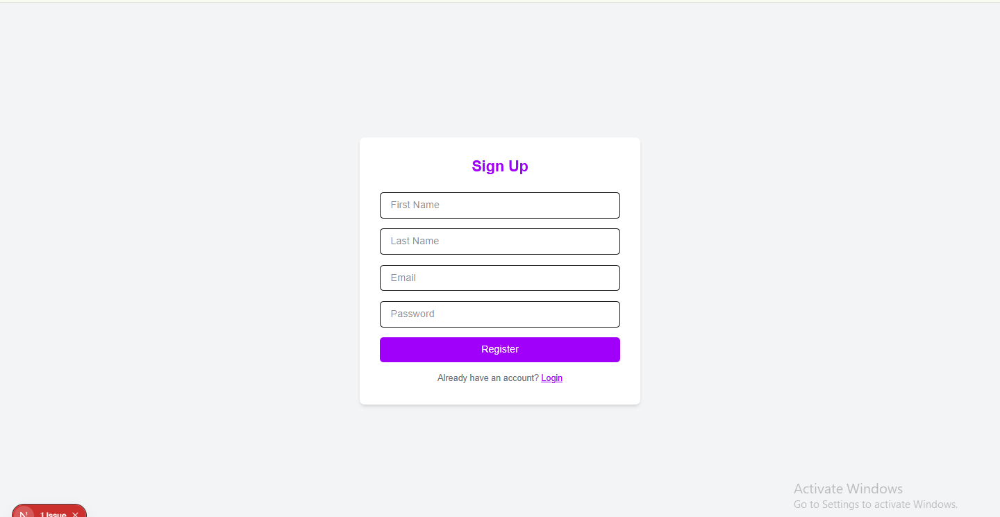

```
npm install jsonwebtoken
npm install bcryptjs
npm i bcrypt
 npm i mysql2
 node -e "console.log(require('crypto').randomBytes(64).toString('hex'))"

```

```

-- Create database (agar pehle se nahi hai)
CREATE DATABASE IF NOT EXISTS myauth;
USE myauth;

-- Create users table
CREATE TABLE IF NOT EXISTS users (
  id INT AUTO_INCREMENT PRIMARY KEY,
  first_name VARCHAR(100) NOT NULL,
  last_name VARCHAR(100),
  email VARCHAR(255) UNIQUE NOT NULL,
  password VARCHAR(255) NOT NULL,
  created_at TIMESTAMP DEFAULT CURRENT_TIMESTAMP
);


ALTER TABLE users 
ADD COLUMN active_token TEXT NULL;


-- Insert sample users
INSERT INTO users (first_name, last_name, email, password)
VALUES 
('Aftab', 'Ahmed', 'aftab@example.com', '123456'),
('Ali', 'Khan', 'ali@example.com', 'password123'),
('Sara', 'Bano', 'sara@example.com', 'mypassword'),
('John', 'Doe', 'john@example.com', 'secret'),
('Jane', 'Smith', 'jane@example.com', 'pass1234', NULL);

ALTER TABLE users ADD COLUMN blocked TINYINT(1) DEFAULT 0;
ALTER TABLE users ADD COLUMN role VARCHAR(20) DEFAULT 'user';


SELECT * FROM users;

-- update users set  role ="admin" where id =,
UPDATE users SET role = 'user', blocked =0, active_token=null WHERE id = 7;


```


